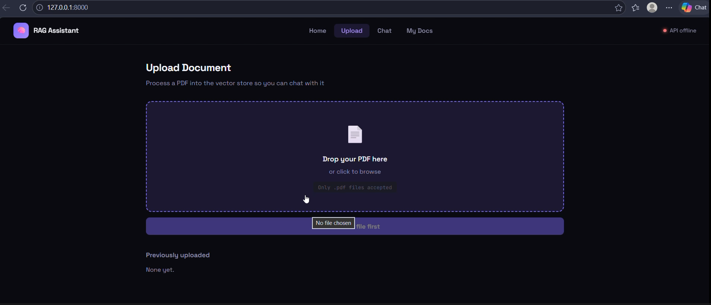
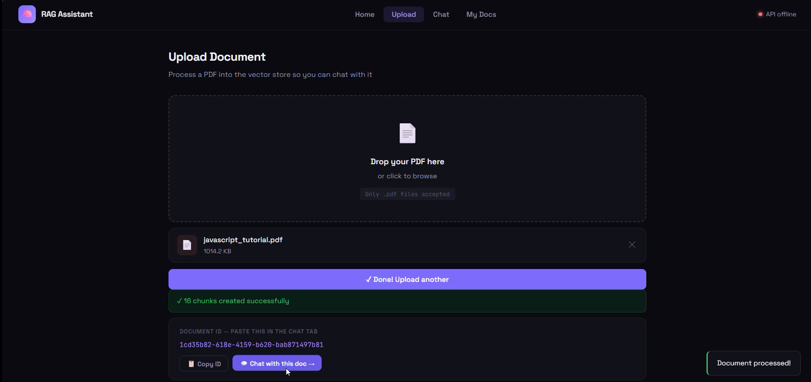
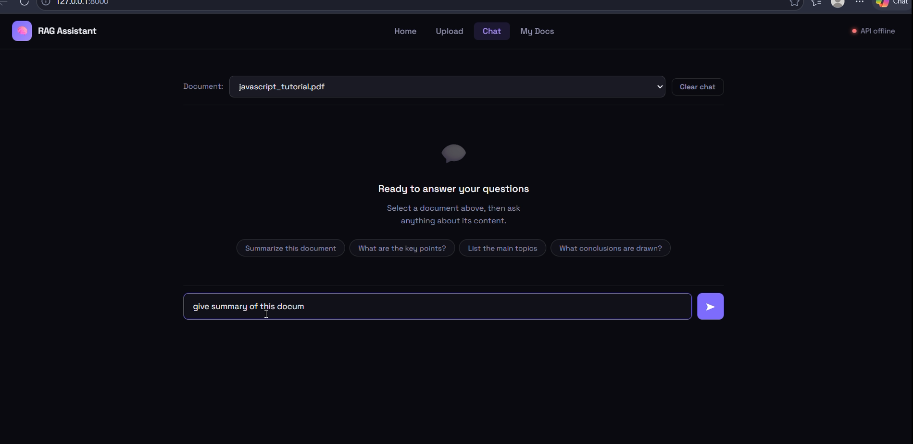
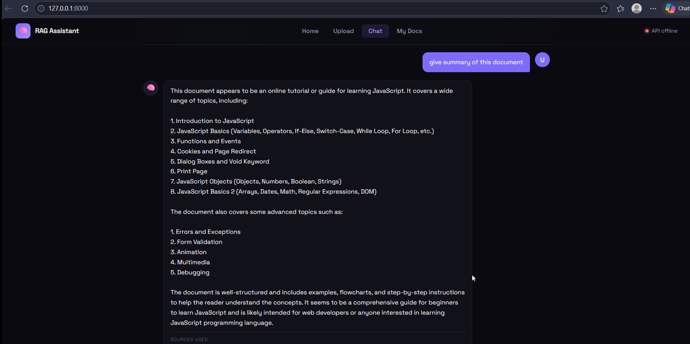

# 📚 RAG AI Assistant

### Retrieval-Augmented Generation (RAG) System for Document Question Answering

A full-stack AI assistant that allows users to upload documents and ask questions in natural language. The system retrieves relevant information from uploaded content using semantic search and generates context-aware responses through a Large Language Model.

Built with FastAPI, Sentence Transformers, PostgreSQL, and Groq-powered LLMs.

---

## 🎯 Problem Statement

Traditional LLMs cannot access user-specific documents and often generate responses without relevant context.

This project solves that problem by implementing a Retrieval-Augmented Generation (RAG) pipeline that retrieves relevant information from uploaded documents before generating responses, resulting in more accurate and context-aware answers.

---

## 🚀 Features

### 📄 Document Upload & Processing

* Upload PDF documents
* Automated text extraction
* Intelligent document chunking
* Embedding generation pipeline

### 🔍 Semantic Retrieval

* Vector-based similarity search
* Context retrieval using embeddings
* Relevant document chunk selection
* Query-aware retrieval workflow

### 🤖 AI-Powered Question Answering

* Natural language querying
* Context-aware responses
* Reduced hallucinations through retrieval
* Groq-powered LLM inference

### ⚡ Backend Architecture

* FastAPI-based REST API
* Modular service architecture
* Decoupled ingestion and retrieval pipelines
* Scalable backend design

---

## 📸 Screenshots










---

## 🏗️ System Architecture

```text
User Uploads Document
          │
          ▼
Text Extraction
          │
          ▼
Document Chunking
          │
          ▼
Embedding Generation
(Sentence Transformers)
          │
          ▼
Embedding Storage
          │
          ▼
User Query
          │
          ▼
Query Embedding
          │
          ▼
Similarity Search
          │
          ▼
Relevant Context Retrieval
          │
          ▼
Groq LLM (LLaMA 3.1)
          │
          ▼
Final Response
```

---

## 🛠️ Tech Stack

### Backend

* FastAPI
* Python

### AI & Retrieval

* Sentence Transformers
* all-MiniLM-L6-v2
* Retrieval-Augmented Generation (RAG)

### LLM

* Groq API
* LLaMA 3.1

### Database

* PostgreSQL

### Tools

* Git
* GitHub

---

## 🧠 RAG Pipeline

### Step 1: Document Ingestion

* Upload PDF documents
* Extract raw text
* Split into manageable chunks

### Step 2: Embedding Generation

* Generate dense vector embeddings using Sentence Transformers
* Convert textual information into semantic representations

### Step 3: Similarity Search

* Convert user query into embedding
* Retrieve top-k most relevant document chunks

### Step 4: Context Augmentation

* Inject retrieved context into the prompt
* Send enriched prompt to LLM

### Step 5: Response Generation

* Groq-powered LLaMA model generates final answer
* Responses are grounded in retrieved document content

---

## 📡 API Endpoints

### Upload Document

```http
POST /upload
```

Uploads and processes documents for retrieval.

### Chat With Assistant

```http
POST /chat
```

Returns context-aware responses based on uploaded documents.

---

## 🔒 Engineering Considerations

* Modular service architecture
* Separation of ingestion and retrieval pipelines
* Efficient embedding generation workflow
* Reduced hallucination through context grounding
* Scalable API-first design

---

## 💡 Future Improvements

* Conversation Memory
* Streaming Responses
* FAISS / Chroma Integration
* Multi-Document Collections
* Hybrid Search (Keyword + Semantic)
* Authentication System
* Docker Deployment
* Cloud Infrastructure (AWS/GCP)

---

## 📚 Skills Demonstrated

* FastAPI Development
* REST API Design
* Retrieval-Augmented Generation
* Vector Search
* Embedding Models
* LLM Integration
* Prompt Engineering
* Backend Architecture
* Database Design
* AI System Development

---

## 👨‍💻 Author

**Rajshekhar Singh**

* GitHub: https://github.com/Rajshekhar061
* Portfolio: https://my-portfolio-9wb7.onrender.com
* LinkedIn: https://www.linkedin.com/in/rajshekhar-singh-572574276

---

## ⭐ Support

If you found this project useful:

* ⭐ Star the repository
* 🍴 Fork the repository
* 💬 Share feedback
